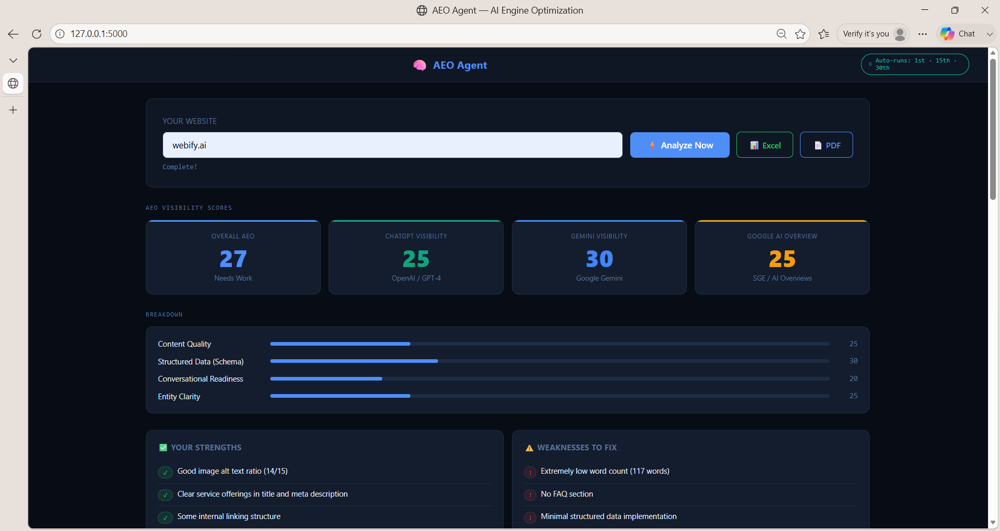
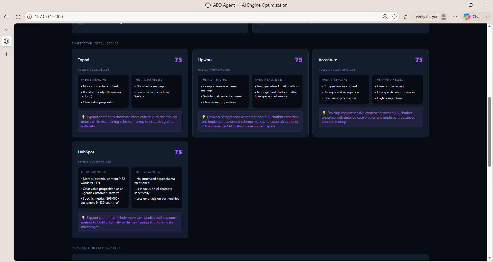
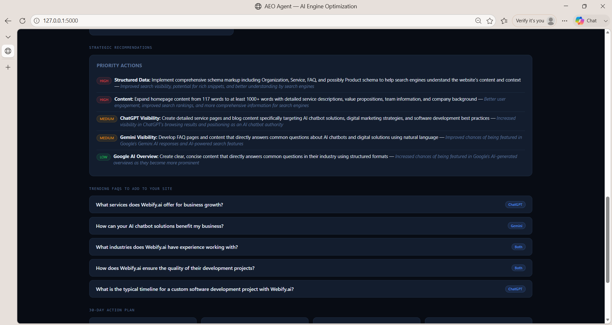
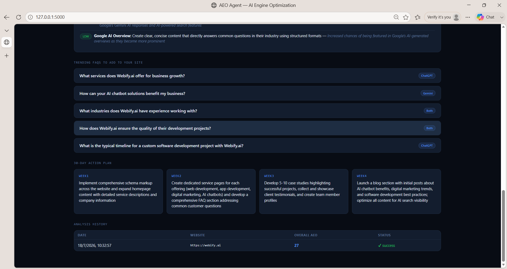

# 🧠 AEO Agent — AI Engine Optimization Bot

> **Analyze any website's visibility on ChatGPT, Gemini & Google AI Overview in under a minute.**

AEO Agent scrapes your site (and up to 4 competitors) through **Scrapfly**, scores your visibility on each AI engine with **Z.ai**, then generates:

- 📊 Per-platform AEO scores (0–100) with a colour-coded breakdown
- 🕵️ Competitor intelligence — what they do better, where you can outrank them
- 💡 5 trending FAQs to add to your site (platform-targeted)
- 🎯 5 strategic recommendations (HIGH / MEDIUM / LOW priority)
- 📅 A 30-day action plan, week by week
- 📥 Downloadable **Excel** (4 sheets) and **PDF** (branded) reports
- 🐳 One-command Docker / docker-compose deploy
- 💾 Smart in-memory cache — repeat analyses of the same URL don't burn API credits

> **Bonus:** Auto-runs on the **1st, 15th, and 30th of every month at 02:00 UTC** via APScheduler — set the URL once, get fresh reports for free.


[](https://github.com/Asiyaarab/AeoAgent/actions/workflows/ci.yml)


---

## 📸 Screenshots

Dashboard preview:

| | |
| --- | --- |
|  |  |
|  |  |

---

## ✨ Features

- 🌐 **Real website scraping** via Scrapfly — bypasses Cloudflare, executes JS, handles SPA sites
- 🤖 **AI-powered scoring** via Z.ai (OpenAI-compatible) — different scoring rules per platform
- 🕵️ **Competitor detection** — AI identifies 4 direct competitors automatically
- ⚔️ **Head-to-head analysis** — strengths, weaknesses, opportunities per competitor
- ❓ **FAQ generator** — 5 trending FAQs tailored to ChatGPT / Gemini / Both
- 📋 **30-day action plan** — week-by-week tactical recommendations
- ⏰ **Scheduled runs** — auto-reports on the 1st, 15th, 30th at 02:00 UTC
- 📊 **Excel export** — 4-sheet workbook with brand styling
- 📄 **PDF export** — A4 layout, colour-coded scores, copy-paste ready
- 🔌 **REST API** — **10 endpoints** for programmatic access (incl. `/api/health`,
  `/api/version`, `/api/compare`)
- 💾 **CSV history** — every run appended to `data/analysis_history.csv`
- 📁 **JSON archives** — full reports saved to `reports/report_<id>.json`
- 🧠 **In-memory cache** — repeat URLs return in <50 ms (TTL configurable)
- 🐳 **Docker-ready** — `docker build` + `docker-compose up` and you're done

---

## 🏗️ Architecture

```
┌──────────────────────────────────────────────────────────────┐
│                         Browser (UI)                         │
│                  app/templates/dashboard.html               │
└────────────────────────────┬─────────────────────────────────┘
                             │ JSON / Fetch
                             ▼
┌──────────────────────────────────────────────────────────────┐
│                       Flask app (main.py)                    │
│                                                               │
│  app/routes.py  ── 10 endpoints (/, /api/*, /download/*)    │
│                                                               │
│  app/analyzer.py  ── pipeline orchestrator (5 stages)        │
│       │                                                       │
│       ├─► app/cache.py    ── TTL result cache (NEW)          │
│       ├─► app/scraper.py  ── Scrapfly  (Cloudflare bypass)   │
│       ├─► app/ai_client.py ── Z.ai  (OpenAI-compatible)      │
│       └─► app/reports.py  ── openpyxl + reportlab            │
│                                                               │
│  app/scheduler.py  ── APScheduler  (1st/15th/30th @ 02:00)  │
│  app/config.py     ── env, paths, constants                  │
│  app/utils.py      ── JSON parsing, URL helpers              │
│  app/version.py    ── __version__ singleton                  │
└────────────────────────────┬─────────────────────────────────┘
                             │
                             ▼
                ┌────────────────────────┐
                │ data/   logs/  reports/│
                └────────────────────────┘
```

### Pipeline (5 stages)

| # | Stage | What happens |
| --- | --- | --- |
| 0 | **Cache check** | Return previous report if URL was analysed within `CACHE_TTL_SECONDS` |
| 1 | **Scrape** | Fetch main site HTML through Scrapfly, extract meta/headings/schema/FAQs |
| 2 | **Competitors** | Ask Z.ai for 4 direct competitor URLs |
| 3 | **AEO Score** | Ask Z.ai for per-platform scores + strengths/weaknesses/quick-wins |
| 4 | **Compare** | Scrape + analyze each competitor head-to-head |
| 5 | **Insights** | Ask Z.ai for FAQs and a 30-day action plan |

---

## 🛠️ Tech Stack

| Layer | Technology |
| --- | --- |
| Web framework | Flask 3.0 + flask-cors |
| Scraping | Scrapfly API (handles Cloudflare / JS / bot detection) |
| AI | Z.ai (OpenAI-compatible) — model: `glm-4.5-flash` |
| Scheduling | APScheduler 3.10 (BackgroundScheduler + CronTrigger) |
| Reports | openpyxl 3.1 (Excel) + reportlab 4.2 (PDF) |
| Caching | Custom in-memory TTL store (thread-safe) |
| Config | python-dotenv |
| Tooling | ruff + black + mypy + pre-commit + Makefile |
| Container | Multi-stage Dockerfile + docker-compose |
| Language | Python 3.10+ |

---

## 🚀 Quick Start

### 🐳 Option 1 — Docker (fastest, no Python install required)

```bash
git clone https://github.com/Asiyaarab/AeoAgent.git
cd AeoAgent
cp .env.example .env       # add your SCRAPFLY_API_KEY and Z_AI_API_KEY
docker-compose up -d
# → http://localhost:5000
```

### 🐍 Option 2 — Local Python (great for development)

```bash
git clone https://github.com/Asiyaarab/AeoAgent.git
cd AeoAgent
python -m venv .venv && source .venv/bin/activate   # Windows: .venv\Scripts\activate
make install-dev            # or: pip install -r requirements.txt -r requirements-dev.txt
cp .env.example .env        # add your keys
make run                    # or: python main.py
```

Open **http://localhost:5000** in your browser, type a website, and watch
the progress bar.

---

## ⚙️ Configuration

All settings live in `app/config.py` and can be overridden via `.env`:

| Variable | Default | Purpose |
| --- | --- | --- |
| `SCRAPFLY_API_KEY` | — | **Required.** Scrapfly account key |
| `Z_AI_API_KEY` | — | **Required.** Z.ai account key |
| `Z_AI_BASE_URL` | `https://open.bigmodel.cn/api/paas/v4` | Override if you proxy Z.ai |
| `Z_AI_MODEL` | `glm-4.5-flash` | Swap model (e.g. `glm-4-plus`) |
| `CACHE_TTL_SECONDS` | `600` | Skip re-analyzing the same URL within N seconds |
| `CACHE_MAX_ENTRIES` | `32` | Max number of URLs to keep in the cache |
| `CORS_ORIGINS` | `*` | Comma-separated list of allowed origins, or `*` for any |
| `FLASK_HOST` | `0.0.0.0` | Bind interface |
| `FLASK_PORT` | `5000` | Bind port |
| `FLASK_DEBUG` | `false` | Flask debug mode |
| `SECRET_KEY` | `change-me-...` | Flask session secret (set a long random one in prod) |
| `LOG_LEVEL` | `INFO` | Python log level |

---

## 🔌 API Reference

Base URL: `http://localhost:5000` — all `/api/*` endpoints support CORS.

### System

#### `GET /api/health`
Liveness probe for Docker / Kubernetes / load balancers. Never touches external services.

```json
{ "status": "ok", "version": "1.1.0", "scheduler_running": true }
```

#### `GET /api/version`
```json
{ "version": "1.1.0" }
```

### Analysis

#### `POST /api/analyze`
Kick off a new analysis. Returns immediately; poll `/api/progress`.

```bash
curl -X POST http://localhost:5000/api/analyze \
  -H "Content-Type: application/json" \
  -d '{"url": "https://example.com"}'
```

**Response:**
```json
{ "status": "started", "url": "https://example.com", "version": "1.1.0" }
```

Returns `400` for missing or malformed URLs.

#### `GET /api/progress`
Stream live progress for the current run.

```json
{ "status": "running", "progress": "Analyzing 4 competitors...", "progress_pct": 65, "run_id": "20260116_102430" }
```

#### `GET /api/report`
Fetch the full completed report (only when `status == "success"`).

#### `GET /api/history`
Last 30 runs (in-memory).

#### `GET /api/scheduler/status`
```json
{
  "running": true,
  "next_run": "2026-07-30T02:00:00+00:00",
  "schedule": "1st, 15th, 30th at 02:00 UTC",
  "configured_url": "https://example.com"
}
```

#### `GET/POST /api/compare`
Side-by-side comparison of 2–3 URLs.

```bash
curl "http://localhost:5000/api/compare?urls=example.com,github.com"
```

Or POST:
```bash
curl -X POST http://localhost:5000/api/compare \
  -H "Content-Type: application/json" \
  -d '{"urls": ["example.com", "github.com"]}'
```

### Downloads

#### `GET /api/download/excel`
Streams a styled 4-sheet `.xlsx` (AEO Summary, Competitors, FAQs & Recs, 30-Day Plan).

#### `GET /api/download/pdf`
Streams a branded A4 `.pdf` report.

---

## 📁 Project Structure

```
AeoAgent/
├── app/                          # All application code
│   ├── __init__.py               # Flask app factory + CORS
│   ├── version.py                # __version__ singleton
│   ├── config.py                 # Env vars, paths, constants
│   ├── utils.py                  # JSON / URL / time helpers
│   ├── cache.py                  # In-memory TTL result cache
│   ├── scraper.py                # Scrapfly integration
│   ├── ai_client.py              # Z.ai wrapper
│   ├── analyzer.py               # 5-stage AEO pipeline
│   ├── reports.py                # Excel + PDF generation
│   ├── scheduler.py              # APScheduler setup
│   ├── routes.py                 # Flask endpoints (10 total)
│   └── templates/
│       └── dashboard.html        # Single-page UI
├── tests/                        # 80+ pytest tests
│   ├── conftest.py
│   ├── test_ai_client.py
│   ├── test_analyzer.py
│   ├── test_cache.py
│   ├── test_config.py
│   ├── test_reports.py
│   ├── test_routes.py
│   ├── test_scheduler.py
│   ├── test_scraper.py
│   ├── test_utils.py
│   └── test_version.py
├── data/                         # auto-created (gitignored)
├── logs/                         # auto-created (gitignored)
├── reports/                      # auto-created (gitignored)
├── main.py                       # Thin entry point
├── requirements.txt
├── requirements-dev.txt
├── pyproject.toml                # Project metadata + tool configs
├── Dockerfile                    # Multi-stage production image
├── docker-compose.yml
├── .dockerignore
├── Makefile                      # install / test / lint / format / run / docker-*
├── .pre-commit-config.yaml
├── Procfile                      # Heroku / Render deployment
├── runtime.txt                   # Python version pin
├── CHANGELOG.md
├── CONTRIBUTING.md
├── SECURITY.md
├── LICENSE
└── README.md
```

---

## 🗓️ Scheduled Runs

The scheduler is started inside `create_app()` and runs in the background.

- **Trigger:** Cron, day `1,15,30`, hour `2`, minute `0`, timezone `UTC`
- **Target URL:** the most recent URL submitted via `/api/analyze`
- **Output:** saved JSON in `reports/`, CSV row in `data/analysis_history.csv`, last 30 kept in memory for `/api/history`
- **Disable:** remove the `init_scheduler()` call in `app/__init__.py`
- **Override schedule:** edit `SCHEDULER_*` constants in `app/config.py`

> ⚠️ Scheduled runs only fire while the Flask process is running. For 24/7 scheduling, deploy to Render / Railway / Fly.io (see below).

---

## ☁️ Deployment

### Docker (recommended)

```bash
docker-compose up -d
```

The image is multi-stage, runs as a non-root user (`aeo`), and has a built-in
`HEALTHCHECK` that hits `/api/health`.

### Render (free tier)

1. Push this repo to GitHub
2. On Render → **New** → **Web Service** → connect the repo
3. Render auto-detects `Procfile` and `runtime.txt`
4. Set environment variables in Render dashboard:
   - `SCRAPFLY_API_KEY`
   - `Z_AI_API_KEY`
   - `SECRET_KEY` (any long random string)
5. Deploy. Your app will be live at `https://<name>.onrender.com`.

### Railway

```bash
railway init
railway variables set SCRAPFLY_API_KEY=... Z_AI_API_KEY=...
railway up
```

### Local (development)

```bash
make run
# → http://localhost:5000
```

---

## 🧪 Smoke Test (without API keys)

```bash
make smoke   # or: python -c "from app import create_app; app = create_app(); print('App created OK:', app)"
```

Expected: `App created OK: <Flask 'app'>`

---

## ✅ Tests

A pytest suite (**80+ tests** across 9 files) covers the full app — config,
utils, scraper, AI client, analyzer pipeline, reports, scheduler, cache,
version, and every Flask route. CI runs the suite on every push and PR
across Python 3.10, 3.11, and 3.12.

### Run locally

```bash
make test           # or: pytest
make test-cov       # with coverage report
```

### What's covered

| File | What it asserts |
| --- | --- |
| `tests/test_config.py` | `BASE_DIR`/`DATA_DIR`/`LOG_DIR`/`REPORT_DIR` are `Path` objects, directories are auto-created, default `FLASK_HOST`/`FLASK_PORT`/`SECRET_KEY`, external endpoints use HTTPS, `Z_AI_MODEL` is non-empty. |
| `tests/test_utils.py` | `normalize_url` adds `https://` only when needed, `extract_domain` strips path/scheme and handles empty input, `parse_json` handles plain JSON + markdown fences, `safe_extract_json_array` finds the first list and returns `[]` when none exists, `now_compact` format, `date_only` slice. |
| `tests/test_routes.py` | All 10 routes registered, `/api/health` + `/api/version` return JSON, `/api/analyze` validates URLs, `/api/compare` accepts GET + POST, CORS headers present. |
| `tests/test_scraper.py` | HTML parsing extracts title, meta, headings, FAQs, schema types, link/image counts, strips `<script>`/`<style>`; handles list-typed JSON-LD and invalid JSON-LD gracefully. |
| `tests/test_ai_client.py` | Z.ai wrapper sends the right headers / payload, raises on missing key / 4xx-5xx, uses the custom system prompt when supplied. |
| `tests/test_analyzer.py` | 5-stage pipeline orchestrated correctly, cache short-circuit, fallback AEO scoring, history push, error path, JSON report persisted. |
| `tests/test_reports.py` | Excel and PDF reports return valid attachments (correct MIME, `.xlsx` has 4 sheets, `.pdf` starts with `%PDF-`), both 404 when no report exists. |
| `tests/test_scheduler.py` | URL bookkeeping, idempotent `init_scheduler`, `next_run` ISO format. |
| `tests/test_cache.py` | TTL expiry, URL normalization, max-entries eviction, `stats`, `clear`. |
| `tests/test_version.py` | `__version__` exposed, semver-shaped. |

CI status: see the badge at the top of this README.

---

## 🐛 Troubleshooting

| Problem | Fix |
| --- | --- |
| `SCRAPFLY_API_KEY missing from .env` | Create `.env` (copy from `.env.example`) and add your key |
| `Z.ai API status: 401` | Wrong/expired Z.ai key. Generate a new one at open.bigmodel.cn |
| `ModuleNotFoundError` | Run `pip install -r requirements.txt` inside your venv (or `make install-dev`) |
| Scheduler doesn't fire | Make sure the Flask process is running at 02:00 UTC. For 24/7 use, deploy. |
| Empty dashboard | Check browser console — likely CORS. Access via `http://localhost:5000`, not `file://`. Set `CORS_ORIGINS` in `.env` for cross-origin frontends. |
| PDF download fails | `pip install reportlab --upgrade` (needs ≥ 4.0) |
| Docker healthcheck failing | Wait 10 s for the app to start, then `curl http://localhost:5000/api/health` |
| URL is rejected by `/api/analyze` | The regex requires `https://host.tld` — `https://localhost` or raw IPs won't work |

---

## 🤝 Contributing

PRs welcome! See [`CONTRIBUTING.md`](./CONTRIBUTING.md) for the dev setup,
style guide, and how to add new features. Please read
[`SECURITY.md`](./SECURITY.md) for how to report security bugs.

---

## 🗺️ Roadmap

- [x] Persist history in SQLite instead of memory
- [x] Add a `/api/compare?urls=a.com,b.com` endpoint
- [x] Dockerfile + docker-compose
- [x] In-memory TTL cache for repeat URLs
- [ ] Email the PDF report automatically on scheduled runs
- [ ] Multi-language support (Hindi / Spanish / French reports)
- [ ] Replace Z.ai with a swappable provider (OpenAI, Anthropic, local Llama)
- [ ] User accounts + per-domain tracking over time
- [ ] Webhook notifications when scores drop

---

## 📜 License

MIT — see [`LICENSE`](LICENSE).

---

## 🙋‍♀️ Maintainer

**Asiya Arab**
- GitHub: [@Asiyaarab](https://github.com/Asiyaarab)
- Project: [github.com/Asiyaarab/AeoAgent](https://github.com/Asiyaarab/AeoAgent)

Built with ❤️ for the AEO / GEO community.
